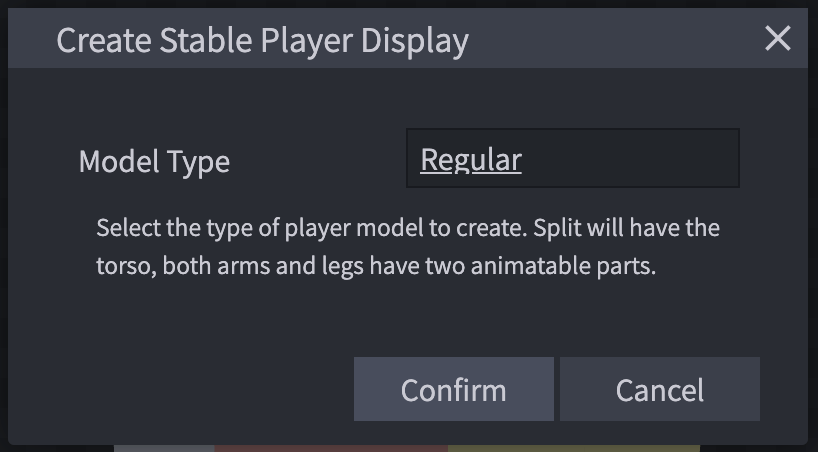

<div align=center>
	
	<h1 >Player Animated Java
	</h1>
</div>
<div align="center">
	
	
	<a href="https://discord.com/invite/jFgY4PXZfp"></a>
	
</div>
<h3 align="center">
	A Blockbench plugin that makes complex animation a breeze in Minecraft: Java Edition.
</h3>

# README: Side Note!

Hi! Kubik here. Before continuing I want to make some stuff clear :

-   I do not participate in AJs or SPDs development
-   I "merged" the projects together for a simpler and accessible use
-   I kept every link towards Animated Java, including in this README. Show them support! (totally to avoid merge conflicts too lol)
-   Changes are written down in the [CHANGES.md](./CHANGES.md) file

So credits to the original Animated Java project: https://animated-java.dev
As well as Stable Player Display (SPD): https://github.com/bradleyq/stable_player_display

## So now that this is clear, why?

This "Player Animated Java" allows you to easily animate custom players, while keeping the power of Animated Java. **This only works for 1.21.5+** (tested in 1.21.8).

## How to use PlayerAJ?

Create an AJ project like usual, and click on the new button:


You'll be asked to choose between **regular** and **split**. Regular has 6 animatable cubes: head, torso, 2 arms and 2 legs. Split has **two parts** for the torso, arms and legs meaning that you'll have 11 animatable cubes.



Now you can animate your player in the animate tab. **MAKE SURE YOU DO NOT APPLY ANY TEXTURES TO THE PLAYER!** You can then export like usual and summon the rig as usual.

You won't see anything at first and that's normal! You have to apply the skin you want to show:

```
# Apply defined skin to the nearest rig
/execute as @n[tag=aj.<namespace>.root] run function animated_java:<namespace>/set_skin {name:"<player name>"}

# You can also apply a slim variant
/execute as @n[tag=aj.<namespace>.root] run function animated_java:<namespace>/set_skin_slim {name:"<player name>"}

# Apply skin of the current player (this has to be executed AT the rig not AS!)
/execute at @e[tag=aj.<namespace>.root] run function animated_java:<namespace>/apply_skin

# Or same with the slim variant
/execute at @e[tag=aj.<namespace>.root] run function animated_java:<namespace>/apply_skin_slim
```

Depending on what model type you use (regular/split) you have to apply the right StablePlayerDisplay resource pack. You can find the `SPD.zip` and `SPD_split.zip` resource packs in the [Releases tab](https://github.com/OpenVoxelStudios/player-animated-java/releases/latest). Only apply one of them at a time, so I guess you can't really have two different types in the same world...

# How to install Player Animated Java?

Open BlockBench, open the "File" > "Plugins" menu and then click "Load plugin from url" and paste this link in:

```
https://github.com/OpenVoxelStudios/player-animated-java/releases/latest/download/animated-java.js
```

Make sure to have regular AJ uninstalled.

**The following text comes from the original Animated Java README.**

# What is Animated Java?

Animated Java is a plugin for Blockbench that allows you to create custom animations and models
for Vanilla Minecraft. It uses the power of Java Edition's Data Pack and Resource Pack systems
to bring your creations to life!

## Features

-   Variants: Swap between different textures in-game.
-   Highly optimized: Hours of performance tests and optimization tweaks have gone into Animated
    Java's Exported Data Pack to make sure it has as little performance impact as possible.
-   Custom easing functions for keyframes.
-   Limited Molang support. If Blockbench can render it, Animated Java can bake it.
-   Text Display previewing and animation support.
-   Resource Pack-less exporting. Animate Vanilla block and item models!
-   Locators: Run commands relative to a locators position via keyframes.
-   Camera Plugin Support: Install the [Official Camera Plugin](https://www.blockbench.net/plugins/cameras) to create cinematic camera paths with ease!
-   Animation Tweening: Create smooth transitions between animations.
-   Many different configuration options.
-   Complete Documentation at https://animated-java.dev

And much more!

# How to Install

Follow our guide [here](https://animated-java.dev/docs/getting-started/installing-animated-java) for detailed instructions on how to install the latest release of Animated Java.

# Getting Started

Check out the [Getting Started](https://animated-java.dev/docs/getting-started/installing-animated-java) page of our documentation to learn how to use Animated Java.

# Contributing to Animated Java

We welcome contributions to Animated Java! If you're interested in contributing, please make sure to run your ideas by us in our [Discord server](https://discord.com/invite/jFgY4PXZfp) before starting work on them. So that we can ensure that your contributions align with the goals of the project.

## Prerequisites

Things you'll need installed before you can setup the development environment

-   [Blockbench](https://www.blockbench.net/)
-   [Node.js](https://nodejs.org/en/)
-   [Yarn](https://classic.yarnpkg.com/lang/en/docs/install/#windows-stable)

## Setting up the Development Environment

1. Clone the repository.
2. Run `yarn install` to install dependencies.
3. Open up `types/blockbench-types.d.ts` and replace the content of the file with the following:
    ```ts
    /// <reference types="blockbench-types"/>
    ```
4. Run `yarn dev` to start the development environment, which will watch for changes and recompile the plugin.
5. Open Blockbench, then go to `File > Plugins > Load Plugin From File` and select the `animated_java.js` file from your local repo (`dist/pluginPackage/animated-java.js`).
6. That's it! You're ready to start developing.

> [!NOTE]
> Note that whenever you make changes, you must reload Blockbench as a whole for the changes to function as expected.<br>
> You can use `Ctrl + Shift + R` to reload Blockbench.

## Adding Localizations

1. Follow the steps above to set up the development environment.
2. Duplicate `src/lang/en.yml` and rename it to match the language you're translating to. (e.g. `fr.yml` for French)
3. Start Translating! Make sure to check your changes in Blockbench to ensure they display correctly.
4. Once you're done translating, open a pull request with your changes.
